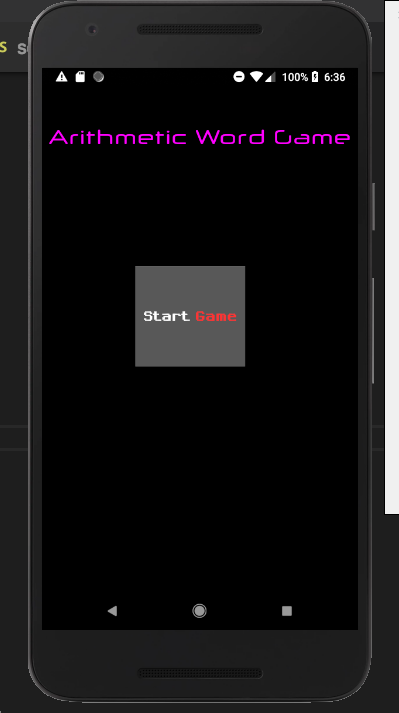
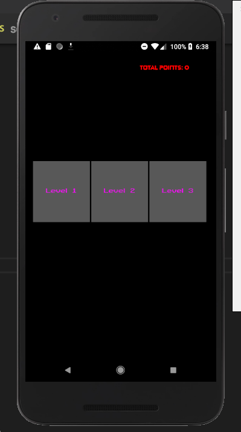
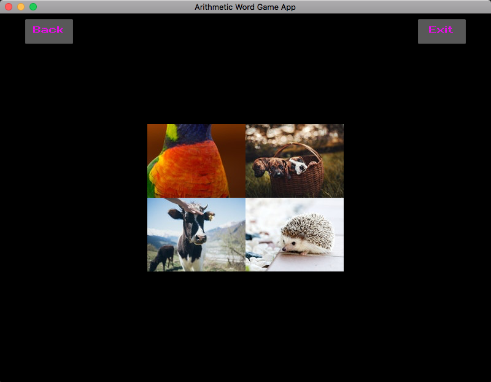
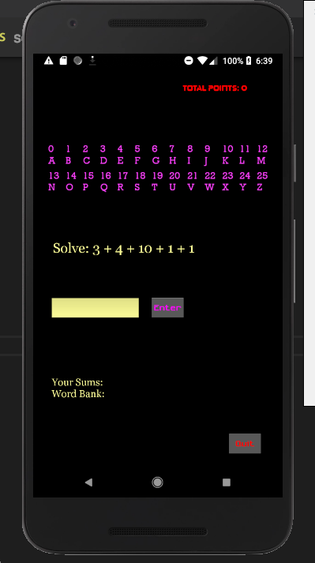
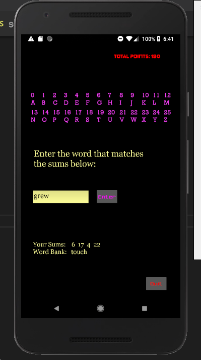
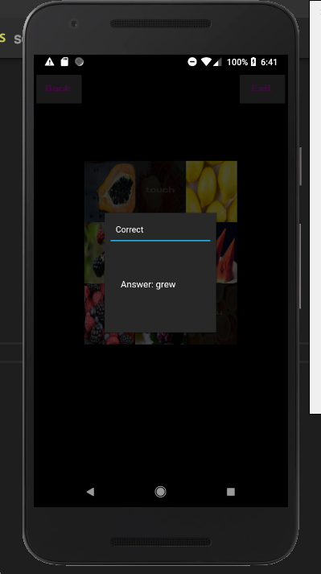

# Arithmetic Word Game App For Grade School Kids

## Scope

1. Display a grid of squares.
2. Each level has a designated number of squares increasing as follows:
    level 1=2^2  
    level 2=3^2
    level 3=4^2
3. Each square is assigned a group of questions.
4. Users can select a square to answer questions on that square.
5. Users must perform arithmetic operations to answer each question correctly. The answers will always be between 0 and 25.
6. After correctly answering the questions, users can map the answers to letters to form a word.
7. If the user is unable to get the correct answer, the answer will be provided to the user.
8. The answers are mapped to letters by using the answers as index points.

    A = 0
    B = 1
    C = 2
    .
    .
    .
    Y = 24
    Z = 25

9. Users can keep answering questions on each square until they have completed all squares on the grid.
10. (In Progress) Answers derived from a group of squares will form a sentence.

## Scores

1. Each square of the grid is assigned a score.
2. Squares are assigned points directly proportional to their level of difficulty. Difficult squares are worth more points.
3. No points are given for incorrect answers.
4. There are chances of double scores and jackpot on randomly selected grids. This is only available to users playing the game at level 2 (9 squares) and higher.

## Time

1. The game will be timed. Users are expected to complete a grid within a certain time limit.
2. Users are expected to answer each question on each square block within a certain time limit.
3. Once a user has exceeded a certain time frame, the user will not have an opportunity to gain double scores or jackpot.